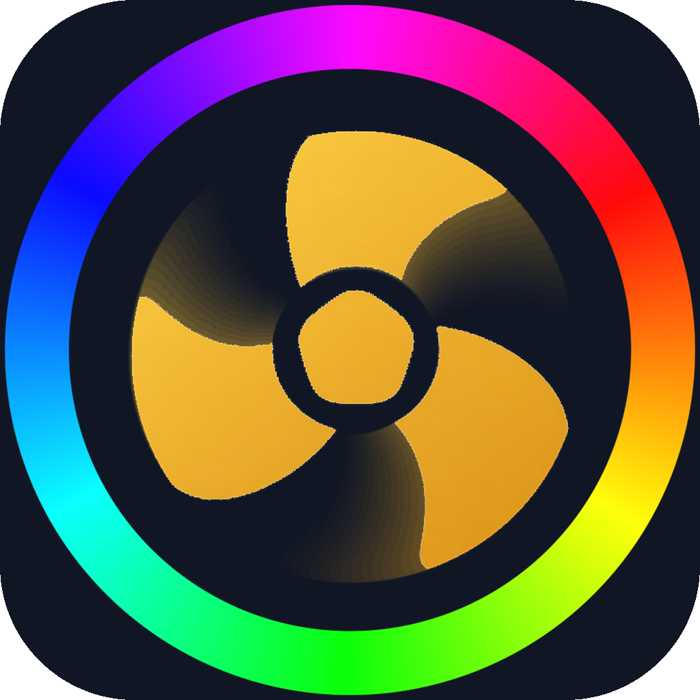
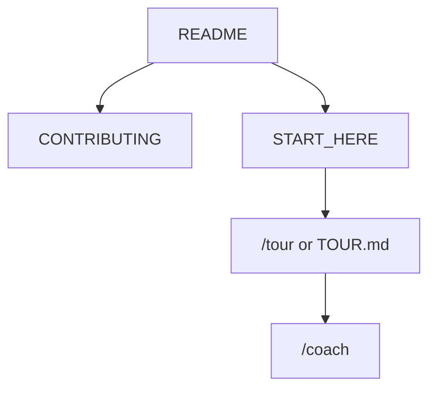

<!-- GENERATED by scripts/generate-project-readme.py — edit branding/product.json -->

  

<h1 align="center">ChromaFlow</h1>

<strong>Fans, pumps, and lighting in one Linux Mint app</strong>

  
  
  
  
  
  
  
  
  
  
  
  
  
  
  
  

  
  

## Pitch

ChromaFlow is an independent Linux-native desktop app for cooling (fans, pumps, AIO) and RGB/LED control. It discovers what the kernel actually exposes, explains the usual Linux gaps versus Windows OpenRGB, and offers one-click Install detection support plus rescan — without shipping kernel modules or running the GUI as root.

## Demo

  

> Locked mark: navy rounded square, full-spectrum hue ring, gold three-blade fan with motion trails. Linux panel and Windows taskbar use the color PNG/ICO. The banner above is the photorealistic brand shot (glass floor, neon glow, circuitry wall).

> GitHub Pages demo for the `examples/web` Golden Path (not the desktop app): [https://edwardlthompson.github.io/chromaflow/](https://edwardlthompson.github.io/chromaflow/). Add product screenshots under `docs/images/` when available.

## Features

- Read-only inventory of hwmon, hidraw, i2c, optional liquidctl, and a localhost OpenRGB SDK probe
- Support page: curated modules/udev/apt checklist with dry-run JSON; live apply only via polkit
- Never bundles .ko files; never modprobe names that are not on the YAML allowlist
- GUI and CLI refuse to run as root; PWM duty uses a watchdog daemon and a firmware failsafe (never silent 0%)
- Detects CoolerControl, fancontrol, and fan2go so we do not fight them silently

## Quick start

1. On Linux Mint 21/22: install Rust (stable) and Node 22, then `cargo test --workspace --exclude chromaflow-desktop` in the repo root (product crates) and `cd apps/desktop && npm ci`.
2. Run `cargo run -p chromaflow-cli -- sensors` and `bash scripts/install-support.sh --dry-run` (no root, no modprobe).
3. Missing fans or LEDs: open the Support tab and use Install detection support + rescan. Log out of Cinnamon after udev/group changes.
4. Read `NOTICE`, `docs/HARDWARE.md`, and `docs/SUPPORT-SCRIPT.md` before enabling experimental modules.

## For humans

Start with this README, then [`CONTRIBUTING.md`](CONTRIBUTING.md) and [`docs/BEST_PRACTICES.md`](docs/BEST_PRACTICES.md). The first-month playbook is [`docs/FIRST_30_DAYS.md`](docs/FIRST_30_DAYS.md).

## For agents

Read [`docs/START_HERE.md`](docs/START_HERE.md) and [`AGENTS.md`](AGENTS.md). In Cursor type `/tour` or `/bootstrap`. Any other IDE: ask the agent to read [`docs/help/TOUR.md`](docs/help/TOUR.md). `/coach` is the next recommended action.

## Install

Primary test target is Linux Mint 21/22 (Cinnamon). We do not ship kernel modules. Inventory (`chromaflow sensors|devices|rescan`) works offline as an unprivileged user. Install the app with `bash scripts/build-chromaflow-deb.sh` then `sudo dpkg -i target/deb/chromaflow_0.2.1_amd64.deb` (see `packaging/README.md`). The package ships the color app icon (hicolor PNG + SVG). `apps/desktop/src-tauri/icons/icon.ico` is the Windows taskbar/Start icon for a future NSIS/MSI build — PWM on Windows is not in this release. After udev or group changes (i2c, plugdev), log out. OpenRGB is a hidden sibling engine, not a second Start-menu app.

## Usage

Do not run the GUI or `chromaflow` with sudo. Use Support → Install detection support for modules/udev (polkit prompt). Never set PWM to 0% without an explicit confirm — the watchdog failsafe restores motherboard firmware control if the app or daemon stops. If CoolerControl or fancontrol is already running, ChromaFlow warns and does not take over. Lighting talks to OpenRGB on 127.0.0.1:6742 (spawn a pinned engine if the port is down). Uncontrolled USB HID is listed for research (no Apply). Config lives in `~/.config/chromaflow/`.

## Configuration

Copy [`.env.example`](.env.example) to `.env` for local secrets (never commit `.env`). Stack-specific config lives in the active `examples/` or app root after prune.

## Contributing

See [`CONTRIBUTING.md`](CONTRIBUTING.md). Prefer small PRs; follow Conventional Commits and the BUILD_PLAN labels (`AGENT` / `HUMAN` / `ADB` / `AUTO`). Status markers: 🔲 open · ✅ done · ❌ blocked.

## Security

See [`SECURITY.md`](SECURITY.md). Enable Dependabot alerts and follow [`docs/SECURITY_TRIAGE.md`](docs/SECURITY_TRIAGE.md) for weekly CVE triage.

## License

[MIT License](LICENSE) — see the license file for terms.

## Acknowledgments

Scaffolded with [agent-project-bootstrap](https://github.com/edwardlthompson/agent-project-bootstrap). Brand assets: [`branding/BRANDING.md`](branding/BRANDING.md). Design system: [`docs/DESIGN_GUIDE.md`](docs/DESIGN_GUIDE.md).
