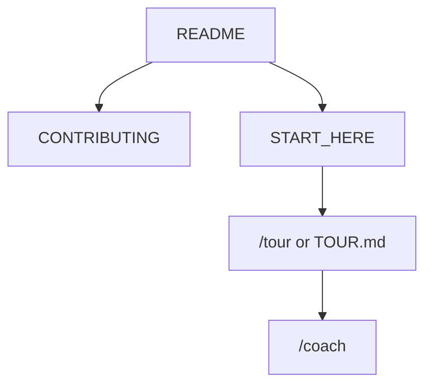

<!-- GENERATED by scripts/generate-project-readme.py — edit branding/product.json -->

  

<h1 align="center">ChromaFlow</h1>

<strong>Fans, pumps, and lighting in one Linux Mint app</strong>

  
  
  
  
  
  

  
  

## Pitch

ChromaFlow is an independent Linux-native desktop app for cooling (fans, pumps, AIO) and RGB/LED control. It discovers what the kernel actually exposes, explains the usual Linux gaps versus Windows OpenRGB, and offers one-click Install detection support plus rescan — without shipping kernel modules or running the GUI as root.

## Demo

  

> Add screenshots or a short demo GIF under `docs/images/` and link them here when available.

## Features

- Read-only inventory of hwmon, hidraw, i2c, optional liquidctl, and a localhost OpenRGB SDK probe
- Support page: curated modules/udev/apt checklist with dry-run JSON; live apply only via polkit
- Never bundles .ko files; never modprobe names that are not on the YAML allowlist
- GUI and CLI refuse to run as root; PWM writes are not implemented until a watchdog daemon exists
- Detects CoolerControl, fancontrol, and fan2go so we do not fight them silently

## Quick start

1. On Linux Mint 21/22: install Rust (stable) and Node 22, then `cargo test --workspace --exclude chromaflow-desktop` in the repo root (product crates) and `cd apps/desktop && npm ci`.
2. Run `cargo run -p chromaflow-cli -- sensors` and `bash scripts/install-support.sh --dry-run` (no root, no modprobe).
3. Missing fans or LEDs: open the Support tab and use Install detection support + rescan. Log out of Cinnamon after udev/group changes.
4. Read `NOTICE`, `docs/HARDWARE.md`, and `docs/SUPPORT-SCRIPT.md` before enabling experimental modules.

## For humans

Start with this README, then [`CONTRIBUTING.md`](../../CONTRIBUTING.md) and [`docs/BEST_PRACTICES.md`](../../docs/BEST_PRACTICES.md). The first-month playbook is [`docs/FIRST_30_DAYS.md`](../../docs/FIRST_30_DAYS.md).

## For agents

Read [`docs/START_HERE.md`](../../docs/START_HERE.md) and [`AGENTS.md`](../../AGENTS.md). In Cursor type `/tour` or `/bootstrap`. Any other IDE: ask the agent to read [`docs/help/TOUR.md`](../../docs/help/TOUR.md). `/coach` is the next recommended action.

## Install

Primary test target is Linux Mint 21/22 (Cinnamon). We do not ship kernel modules. Inventory (`chromaflow sensors|devices|rescan`) works offline as an unprivileged user. The polkit helper (`/usr/libexec/chromaflow/install-support.sh`) is installed by a future .deb; the repo copy is `scripts/install-support.sh`. After udev or group changes (i2c, plugdev), log out. AppImage (later) will not install polkit — use the .deb for the helper.

## Usage

Do not run the GUI or `chromaflow` with sudo. Use Support → Install detection support for modules/udev (polkit prompt). Never set PWM to 0% without an explicit action and a failsafe — this release cannot write PWM at all. If CoolerControl or fancontrol is already running, ChromaFlow warns and does not take over. Lighting talks to OpenRGB on 127.0.0.1:6742 only; devices with no Linux backend are labeled, not faked. Config lives in `~/.config/chromaflow/`.

## Configuration

Copy [`.env.example`](../../.env.example) to `.env` for local secrets (never commit `.env`). Stack-specific config lives in the active `examples/` or app root after prune.

## Contributing

See [`../../CONTRIBUTING.md`](../../CONTRIBUTING.md). Prefer small PRs; follow Conventional Commits and the BUILD_PLAN labels (`AGENT` / `HUMAN` / `ADB` / `AUTO`). Status markers: 🔲 open · ✅ done · ❌ blocked.

## Security

See [`../../SECURITY.md`](../../SECURITY.md). Enable Dependabot alerts and follow [`docs/SECURITY_TRIAGE.md`](../../docs/SECURITY_TRIAGE.md) for weekly CVE triage.

## License

[MIT License](../../LICENSE) — see the license file for terms.

## Acknowledgments

Scaffolded with [agent-project-bootstrap](https://github.com/edwardlthompson/agent-project-bootstrap). Brand assets: [`../BRANDING.md`](../BRANDING.md). Design system: [`../../docs/DESIGN_GUIDE.md`](../../docs/DESIGN_GUIDE.md).
