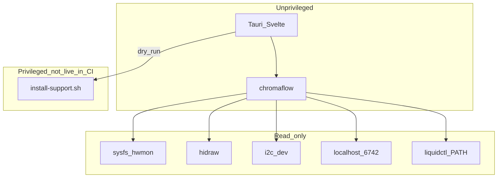

# Architecture

ChromaFlow splits **unprivileged inventory/UI** from a **future privileged daemon** and a **polkit helper**. This document is the source of truth for that split.

## This milestone

- GUI and CLI abort if effective uid is 0.
- No process in this repo writes PWM.
- `scripts/install-support.sh --dry-run` never calls apt, modprobe, usermod, or writes `/etc`.
- `--apply` is stubbed: it exits unless pkexec set `PKEXEC_UID` and the executable path is `/usr/libexec/chromaflow/install-support.sh`.

## Later (not implemented)

`chromaflowd` as a systemd system unit:

- Unix socket with `SO_PEERCRED`
- PWM writes only after `pwm*_enable` is set to a documented mode
- Watchdog: if sensors or the daemon die, PWM → 100% or kernel default
- `ExecStopPost` failsafe
- Explicit confirm when CoolerControl / fancontrol / fan2go is detected

## Packaging

| Artifact | What it may install |
|----------|---------------------|
| `.deb` | GUI, `chromaflow`, helper at `/usr/libexec/chromaflow/install-support.sh`, polkit policy, optional `chromaflowd` |
| AppImage | GUI + CLI only. If the helper is missing, Support explains that a `.deb` (or distro package) is required |

Do not put a writable copy of the helper next to the AppImage and expect polkit to run it.

## Rescan pipeline

`chromaflow rescan` is a fresh **read** of:

1. `/sys/class/hwmon` (or `CHROMAFLOW_HWMON_ROOT` in tests)
2. `/dev/hidraw*` and `/dev/i2c-*` (or `CHROMAFLOW_DEV_ROOT`)
3. `liquidctl` if on `PATH`
4. TCP `127.0.0.1:6742` with a short timeout
5. systemd/process names for cooling conflicts
6. YAML allowlist vs probe text for **gaps** (udev, i2c-dev, missing modules, no OS channel)

Then the GUI shows inventory + Support checklist.

## GUI (Tauri 2)

`apps/desktop` is the Svelte UI. `apps/desktop/src-tauri` is the Tauri 2 host (`chromaflow-gui`, window label `main`). It refuses euid 0 and exposes `support_dry_run` (install-support `--dry-run` only). In a Tauri webview the Support tab calls `invoke('support_dry_run')`; Vite preview uses a fixture JSON.

Default `cargo test` / `cargo clippy` use `default-members` (CLI + core). `cargo test --workspace` also compiles the GUI and needs WebKit. CI `tauri-attempt` installs `libwebkit2gtk-4.1-dev` on Ubuntu 24.04 (required) and 22.04 (best-effort; `continue-on-error`). Do not skip both jobs.

## Config

`~/.config/chromaflow/` — profiles later bind a fan-curve set and an RGB profile. Unused this milestone.

## Golden Path vs product

`examples/web` remains the bootstrap PWA for `feature-gate --stack web`. Product UI is `apps/desktop`. GitHub Pages is not the product.
