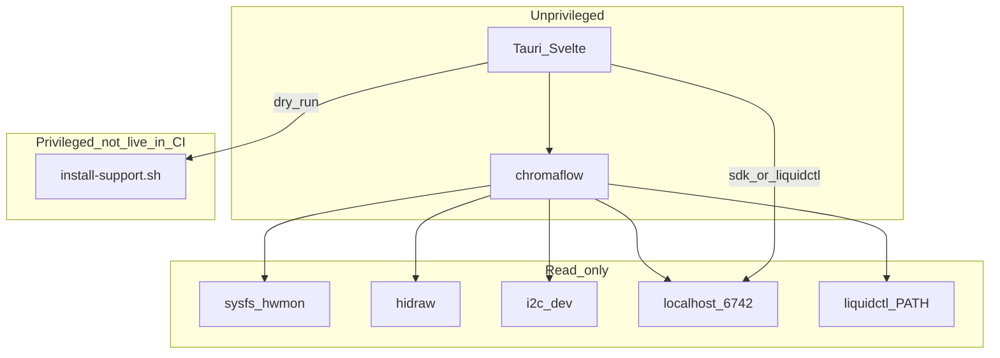

# Architecture

ChromaFlow splits **unprivileged inventory/UI** from a **future privileged daemon** and a **polkit helper**. This document is the source of truth for that split.

## This milestone

- GUI and CLI abort if effective uid is 0.
- PWM duty is written only by the watchdog (`pwm_apply` / `chromaflow daemon --watchdog`) after confirm. Failsafe is `pwm*_enable=2`.
- Lighting color apply uses the OpenRGB SDK or a `liquidctl` subprocess (ADR-0011).
- `scripts/install-support.sh --dry-run` never calls apt, modprobe, usermod, or writes `/etc`.
- `--apply` is pinned: it exits unless pkexec set `PKEXEC_UID` and the executable path is `/usr/libexec/chromaflow/install-support.sh`.

## Later (not implemented)

`chromaflowd` as a systemd **user** unit:

- PWM writes only after `pwm*_enable` is set to manual (1)
- Watchdog: if sensors or the daemon die, PWM → firmware (`pwm*_enable=2`)
- `ExecStopPost` failsafe
- Explicit confirm when CoolerControl / fancontrol / fan2go is detected (take-over stays off)

## Packaging

| Artifact | What it may install |
|----------|---------------------|
| `chromaflow_*.deb` | GUI, `chromaflow`, Cinnamon `.desktop`, helper at `/usr/libexec/chromaflow/install-support.sh`, polkit policy |
| OpenRGB engine file | Optional GPL AppImage under `~/.local/share/chromaflow/` (not a menu app; not in this git tree) |
ChromaFlow is not an AppImage. Do not put a writable copy of the helper next to an engine file and expect polkit to run it.

## Rescan pipeline

`chromaflow rescan` is a fresh **read** of:

1. `/sys/class/hwmon` (or `CHROMAFLOW_HWMON_ROOT` in tests)
2. `/dev/hidraw*` and `/dev/i2c-*` (or `CHROMAFLOW_DEV_ROOT`)
3. `liquidctl` if on `PATH`
4. TCP `127.0.0.1:6742` with a short timeout
5. systemd/process names for cooling conflicts
6. YAML allowlist vs probe text for **gaps** (udev, i2c-dev, missing modules, no OS channel)

Then the GUI shows inventory + Support checklist.

## GUI (Tauri 2)

`apps/desktop` is the Svelte UI. `apps/desktop/src-tauri` is the Tauri 2 host (`chromaflow-gui`, window label `main`). It refuses euid 0 and exposes `inventory`, `support_dry_run`, and `support_apply` (pkexec of the pinned helper). Product smoke is the native window, not Vite preview. In a Tauri webview the UI calls `invoke`; Vite preview may use fixtures / `live-inventory.json` for layout only.

Default `cargo test` / `cargo clippy` use `default-members` (CLI + core). `cargo test --workspace` also compiles the GUI and needs WebKit. CI `tauri-attempt` installs `libwebkit2gtk-4.1-dev` on Ubuntu 24.04 (required) and 22.04 (best-effort; `continue-on-error`). Do not skip both jobs.

## Config

`~/.config/chromaflow/` — profiles later bind a fan-curve set and an RGB profile. Unused this milestone.

## Golden Path vs product

`examples/web` remains the bootstrap PWA for `feature-gate --stack web`. Product UI is `apps/desktop`. GitHub Pages is not the product. **Do not treat Vite preview / Cursor browser as a product launch** — see [`docs/PRODUCT_GAPS.md`](PRODUCT_GAPS.md) G-APP.
