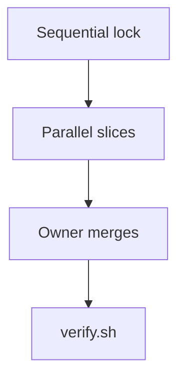
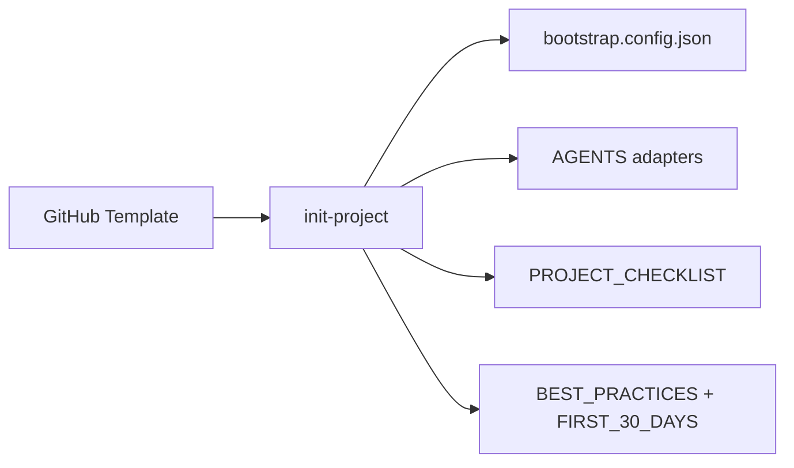

# Why this template exists

This template gives you an industry-standard start **and** teaches why the conventions matter. Read it during `/bootstrap`, `/tour`, or anytime you type `/coach`. The 30-day playbook is [`FIRST_30_DAYS.md`](FIRST_30_DAYS.md). Other IDEs: [`help/TOUR.md`](help/TOUR.md) and [`AGENT_PORTABILITY.md`](AGENT_PORTABILITY.md).

## How to use this page

Each subsection is **What** (the file), **Why** (industry reason + source), **How** (you or the agent). Status markers on checklists: 🔲 open · ✅ done · ❌ blocked.

## LICENSE

- **What:** The legal terms for using and redistributing the project (MIT default; Apache-2.0 at init).
- **Why:** A public repo without a license is not “free to use” — others cannot safely depend on it. See [Choose a license](https://choosealicense.com/) and [opensource.guide — starting a project](https://opensource.guide/starting-a-project/).
- **How:** Keep SPDX identity in `LICENSE`. Child repos pick MIT or Apache-2.0 via `init-project --license`.

## README.md

- **What:** The front door: value proposition, quickstart, architecture.
- **Why:** First-time humans and agents decide in seconds whether they can run the project. GitHub’s [README guidance](https://docs.github.com/en/repositories/managing-your-repositorys-settings-and-features/customizing-your-repository/about-readmes) is the baseline.
- **How:** After product branding, `generate-project-readme.py` writes the pitch README. Keep Quick start copy-pasteable.

## CONTRIBUTING.md and CODE_OF_CONDUCT.md

- **What:** How to send changes, and how people treat each other.
- **Why:** Clear contribution rules reduce drive-by PRs that ignore CI. A code of conduct (Contributor Covenant) is standard for public communities — [opensource.guide — code of conduct](https://opensource.guide/code-of-conduct/).
- **How:** Follow Conventional Commits and BUILD_PLAN labels. Install `pre-commit` including `--hook-type commit-msg`.

## SECURITY.md

- **What:** Vulnerability disclosure (private reporting, timelines).
- **Why:** Public issue trackers are the wrong place for exploitable bugs. GitHub [private vulnerability reporting](https://docs.github.com/en/code-security/security-advisories/guidance-on-reporting-and-writing-information-about-vulnerabilities/privately-reporting-a-security-vulnerability) plus [OWASP](https://owasp.org/) practices.
- **How:** Never file a public issue for a secret or RCE. Use Advisories or CODEOWNERS email. Weekly triage: `docs/SECURITY_TRIAGE.md`.

## GitHub Actions, Dependabot, pre-commit

- **What:** CI (`ci.yml`), Security Scan / CodeQL / gitleaks, local `/update-deps`, Dependabot as weekly backup, local hooks.
- **Why:** Catching lint, tests, leaked secrets, and dependency bumps on the laptop is cheaper than waiting on GitHub Dependabot PRs. RAM-capped parallel `feature-gate` stacks and `/best-of-n` use local CPU; optional Ollama stays on 127.0.0.1 (`docs/LOCAL_MODELS.md`) with no cloud keys. See [GitHub Actions](https://docs.github.com/en/actions) and [Dependabot](https://docs.github.com/en/code-security/dependabot).
- **How:** `bash scripts/verify.sh` before marking a task done. Before a release: `/update-deps` or `just update-deps-dry`. `scripts/setup-github-repo.sh` still enables alerts and branch protection. On Linux, apply [`LINUX_DEV.md`](LINUX_DEV.md) (SSD + caches, direnv, inotify, `nice`/`ionice`, laptop vs CI).

## Linux developer environment

- **What:** [`LINUX_DEV.md`](LINUX_DEV.md) + `.envrc.example` + `just linux-dev` / `check-local-compute`.
- **Why:** Local SSD layout, shared package caches, watcher limits, and parallel job caps cut cycle time more than Cloud Agents when the machine is free.
- **How:** Copy `.envrc.example` → `.envrc`, set `BOOTSTRAP_CHECK_JOBS` / `FEATURE_GATE_JOBS`, raise inotify if Vite/IDE drops events, prefer worktrees over Docker-in-Docker for day-to-day tests.

## BUILD_PLAN labels

- **What:** Every task is `AGENT`, `HUMAN`, `ADB`, or `AUTO`, Sequential then Parallel.
- **Why:** Agents should not block on credentials or devices; humans should not re-do mechanical gates. Isolated Parallel scopes prevent two agents from editing the same files.
- **How:** Finish Sequential `[AGENT]` rows first. After schema lock, `/scope` dispatches Parallel. Status: 🔲 / ✅ / ❌.

## AGENT_MEMORY.md

- **What:** Long-term stack, threats, and retrospectives.
- **Why:** Chat context is expensive and evaporates. A small memory file survives session resets without dumping the whole repo into the prompt.
- **How:** Update **only** at milestones or architectural pivots. Working notes go in gitignored `scratchpad.md`.

## Golden Paths

- **What:** Runnable stubs under `examples/{stack}/` plus `modules/{stack}/MODULE.md`.
- **Why:** A vertical slice (logic + tests + UI) is how modern teams ship; empty folders teach nothing. The path is the template for the next feature.
- **How:** Activate one stack at init. Copy the About/Settings layout. Keep file budgets (150 logic / 300 static).

## AGENTS.md and adapters

- **What:** Canonical agent spec; thin generated pointers for Cursor, Claude Code, Copilot, Windsurf, Antigravity/Gemini, Aider, Cline, and Continue.
- **Why:** Each tool looks in a different file. One source of truth plus generated adapters prevents drift. `GEMINI.md` must stay a pointer — Antigravity treats it as higher priority than `AGENTS.md`.
- **How:** Edit `AGENTS.md`, then `bash scripts/bootstrap-lifecycle.sh --sync-adapters`. Do not hand-edit adapters. See [`AGENT_PORTABILITY.md`](AGENT_PORTABILITY.md).

## verify.sh

- **What:** Unified local harness (env schema + bootstrap gates; `--full` runs feature-gate).
- **Why:** “It passed on my machine” needs one command, not a tribal checklist. Same idea as `make check` in classic Unix projects.
- **How:** Run before every ✅ BUILD_PLAN row. Optional: `just verify` if [just](https://github.com/casey/just) is installed.

## Architecture (template → child)

## First 30 days

Follow [`FIRST_30_DAYS.md`](FIRST_30_DAYS.md). `/coach` will point at the next open row and why it matters. For a ranked list of possible next features, `/ideas` or [`help/IDEAS.md`](help/IDEAS.md). For a complete dump to fill BUILD_PLAN, `/allideas` or [`help/ALLIDEAS.md`](help/ALLIDEAS.md).

## Instrumented ≠ unit tests

| Kind | Runs on | Good for | Not a substitute for |
|------|---------|----------|----------------------|
| Unit (`./gradlew test`, Vitest, pytest) | JVM / Node | Pure logic, i18n, allowlists | System Back, insets, TalkBack |
| Instrumented (`connectedDebugAndroidTest`) | Device / emulator | Nav Back, Compose UI, density | Fast PR feedback when no KVM |
Espresso 3.7+ is required on API 36+. A green unit suite never proves predictive-back or inset behavior — keep one instrumented smoke per nav milestone.
