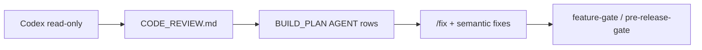

# Codex third-party review (advanced / optional)

**Beginners skip this file.** First-time path is Cline in Cursor: GitHub sign-in, FREE models, human-in-the-loop diffs. See [`docs/help/CLINE.md`](help/CLINE.md). This is **not** onboarding and is **not** part of `/tour`, `/prerelease`, or `/ship`.

OpenAI Codex as a **read-only** reviewer for people who already have a Codex CLI. Repairs run through Cursor Agent (`/fix`) — Codex never writes patches or pushes.

## Used by

| Entry | Behavior |
|-------|----------|
| `/codex-review` | Optional local review → gitignored `CODE_REVIEW.md` → BUILD_PLAN Critical/High rows |
| CI example | [`.github/workflow-examples/codex-review.yml`](../.github/workflow-examples/codex-review.yml) — **not** copied into `.github/workflows/` and **not** in the tour |

Do not run this from `/ship`. Release must work with no OpenAI key.

## Local setup

1. Install the [Codex CLI](https://developers.openai.com/codex/)
2. Set `OPENAI_API_KEY` in the environment (never commit it)
3. Run `/codex-review` only when you explicitly want this review

If the key or CLI is missing, the script prints `SKIP: Codex review (no key/CLI)` and exits 3. That skip is expected. Do not invent findings.

## GitHub Actions (opt-in, not default)

The example workflow is **outside** `.github/workflows/` so CI never auto-runs it:

1. Copy `.github/workflow-examples/codex-review.yml` → `.github/workflows/codex-review.yml` only if you opt in
2. Add repository secret `OPENAI_API_KEY`
3. Optionally mark the job as a required status check (human choice; not default)

The job posts a sticky PR comment, uploads a `CODE_REVIEW.md` artifact, and uses `permission-profile: ":read-only"`.

Download an artifact locally:

```bash
gh run download <run-id> -n codex-code-review
```

## Contract

- Prompt: [`.github/codex/prompts/review.md`](../.github/codex/prompts/review.md)
- Schema: [`.github/codex/schemas/findings.json`](../.github/codex/schemas/findings.json)
- Markdown template: [`CODE_REVIEW.md.example`](../CODE_REVIEW.md.example) (`Source`: `codex-ci` | `codex-local` | `audit`)
- Renderer: `python3 scripts/codex-findings-to-markdown.py -i findings.json -o CODE_REVIEW.md`

`CODE_REVIEW.md` is gitignored.

## Repair handoff



| Path | Use |
|------|------|
| Codex review (CI/local) | Advanced third-party findings only |
| Cline in Cursor | First-time autonomous work (human-in-the-loop diffs) |
| Cursor `/fix` | Mechanical + semantic repair after AGENT steps |
| Multi-stack `feature-autofix.sh` | Format/lint writers (Biome, ruff, cargo fmt, gofmt) |
| Bugbot Autofix | Commercial only — see `docs/CURSOR_COMMERCIAL_ACTIVATION.md` |

## Spend control

- Keep the workflow under `workflow-examples/` until you opt in
- Prefer `workflow_dispatch`-only if PR triggers are too costly
- Do not chain this into `/maintain`, `/prerelease`, or `/ship`

## Related

- [`help/CLINE.md`](help/CLINE.md) — first-time path
- [`CURSOR_CLI.md`](CURSOR_CLI.md) — Cursor CLI headless (separate key)
- [`CURSOR_INTEGRATIONS.md`](CURSOR_INTEGRATIONS.md)
